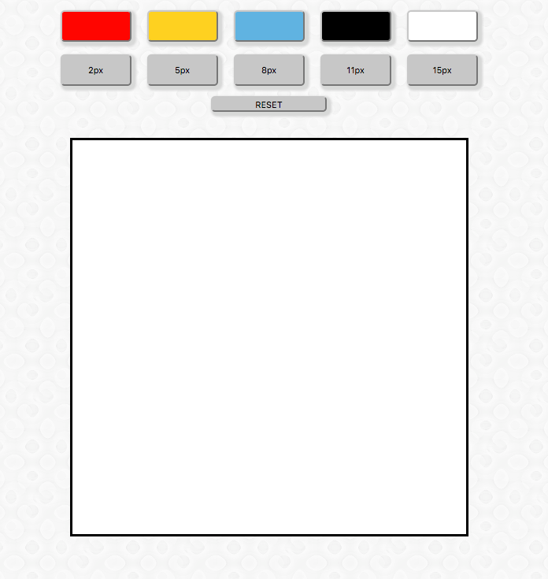

#Draw Together

##Overview of Project
A collaborative drawing app that allows users on different devices to draw on the same canvas at the same time. Created using JavaScript, jQuery, Node.js, Express, and Sockey.io.

##Technologies, Frameworks, and Programming Languages used
* HTML5 & CSS3
* JavaScript
* jQuery
* Node.js
* ExpressJS
* Socket.io

##Project Screenshots

Draw Together's interace

##URL to live project

[Check it out!](https://draw-together-tehczpbnlz.now.sh/)
